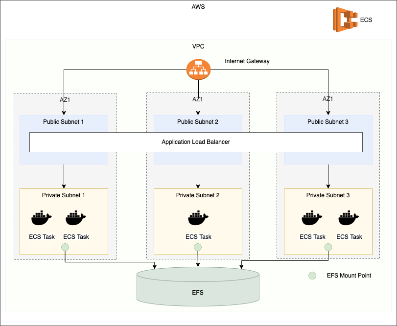

# Setting Apache Nifi AWS ECS using Terraform

## Apache NIFI
[Apache NiFi](https://nifi.apache.org/) is a tool to process and distribute data. Its intuitive UI supports routing definitions, a variety of connectors (in/out), and many built-in processors.  Apache Nifi is the tool if you are looking for a simple, but robust, tool to process data from various sources.

## Launching Nifi Application on AWS
This repository provides Terraform and Github Actions automation to deploy 
- AWS VPC
- AWS Elastic Container Service(ECS) 
- EFS Persistence Storage for NIFI
- Apache NIFI application
- Load Balancer

# Architecture

